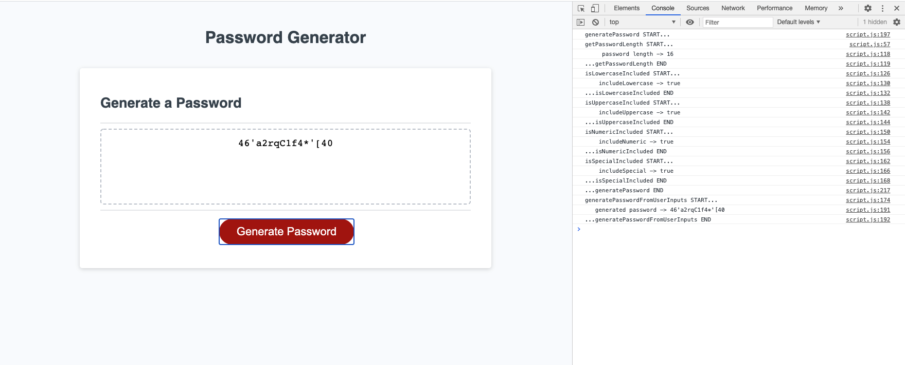

# **Bryan Godwin - Week 3 Challenge**

## **JavaScript Challenge: Password Generator**

### This challenge is to create an application that generates a password based on user-selected criteria

### **User Story**

    AS AN employee with access to sensitive data
    I WANT to randomly generate a password that meets certain criteria
    SO THAT I can create a strong password that provides greater security

### **Acceptance Critera**

1.  Provides user prompts for password critera

        WHEN I click the button to generate a password
        THEN I am presented with a series of prompts for password criteria

2.  User can select password criteria

        WHEN prompted for password criteria
        THEN I select which criteria to include in the password

3.  User can specify password length

        WHEN prompted for the length of the password
        THEN I choose a length of at least 8 characters and no more than 128 characters

4.  User can specify character types

        WHEN prompted for character types to include in the password
        THEN I choose lowercase, uppercase, numeric, and/or special characters

5.  All user input is validated

        WHEN I answer each prompt
        THEN my input should be validated and at least one character type should be selected

6.  Website generates a new user password

        WHEN all prompts are answered
        THEN a password is generated that matches the selected criteria

7.  User is shown the generated password

        WHEN the password is generated
        THEN the password is either displayed in an alert or written to the page

### **Challenge Three - code repository**

<https://github.com/godwinbw/friendly-parakeet>

### **Challenge Three - live link**

<https://godwinbw.github.io/friendly-parakeet/develop/>

### **Challenge Three - screenshot**

